# Versioning & Release Process

VibeSec follows [Semantic Versioning](https://semver.org/) (SemVer) and uses an automated release process.

## Automated Versioning

When a Pull Request is merged to `main`, the version is automatically bumped based on PR labels:

### PR Labels for Version Bumping

| Label | Bump Type | When to Use | Example |
|-------|-----------|-------------|---------|
| `major` or `breaking` | **Major** (1.0.0 → 2.0.0) | Breaking changes, incompatible API changes | Removing MCP support, changing CLI arguments |
| `minor` or `feature` | **Minor** (1.0.0 → 1.1.0) | New features, backward-compatible additions | Adding new detection rules, new reporters |
| `patch`, `bugfix`, or `fix` | **Patch** (1.0.0 → 1.0.1) | Bug fixes, documentation, performance improvements | Fixing false positives, updating docs |

**Default:** If no label is present, a `patch` version bump is applied.

## How It Works

```mermaid
graph LR
    A[PR Merged to main] --> B[Auto-version workflow runs]
    B --> C[Reads PR labels]
    C --> D[Bumps package.json version]
    D --> E[Commits version change]
    E --> F[Creates git tag]
    F --> G[Pushes tag]
    G --> H[Publish workflow triggers]
    H --> I[Runs tests]
    I --> J[Builds package]
    J --> K[Publishes to npm]
    K --> L[Creates GitHub Release]
```



### Workflow Steps

1. **PR is merged** to `main` branch
2. **Auto-version workflow** (`auto-version.yml`) runs:
   - Detects version bump type from PR labels
   - Bumps version in `package.json`
   - Commits the change with `[skip ci]` to avoid loops
   - Creates a git tag (e.g., `v0.2.0`)
   - Pushes the tag to GitHub
3. **Publish workflow** (`publish.yml`) triggers on tag push:
   - Runs full test suite
   - Builds the package
   - Publishes to npm with provenance
   - Creates GitHub Release with notes

## For Contributors

### Adding the Right Label

When creating a PR, add ONE of these labels:

- **Breaking changes?** → Use `major` or `breaking`
- **New feature?** → Use `minor` or `feature`
- **Bug fix or docs?** → Use `patch`, `fix`, or `bugfix`
- **Not sure?** → Use `patch` (safest default)

### Example PR Workflow

```bash
# 1. Create feature branch
git checkout -b feature/new-detector

# 2. Make changes and commit
git add .
git commit -m "feat: Add SQL injection detector for Python"

# 3. Push and create PR
git push origin feature/new-detector

# 4. On GitHub:
#    - Create Pull Request
#    - Add label: "minor" (it's a new feature)
#    - Get review and merge

# 5. Automatic after merge:
#    - Version bumps from 0.1.0 → 0.2.0
#    - Tag v0.2.0 created
#    - Published to npm as vibesec@0.2.0
#    - GitHub Release created
```

## Manual Release (Emergency Only)

If automation fails, you can manually release:

```bash
# 1. Bump version
npm version patch  # or minor, or major

# 2. Push tag
git push origin main --tags

# 3. Publish manually
npm publish --access public

# 4. Create GitHub release manually
gh release create v0.x.x --generate-notes
```

## Version History

See [CHANGELOG.md](../CHANGELOG.md) for complete version history.

## Release Checklist

Before merging a PR for release:

- [ ] All tests passing (CI checks)
- [ ] CHANGELOG.md updated with changes
- [ ] Documentation updated if needed
- [ ] Correct version label applied to PR
- [ ] Breaking changes clearly documented (if applicable)

## Troubleshooting

### "Version already published" error

If npm publish fails because version already exists:

1. Check if tag already exists: `git tag -l`
2. Manually bump version: `npm version patch`
3. Push new tag: `git push origin main --tags`

### "Workflow didn't trigger" issue

If auto-version doesn't run after PR merge:

1. Check workflow runs: GitHub Actions tab
2. Ensure PR was merged (not closed)
3. Check PR labels are correct
4. Verify workflow permissions in repo settings

### "Tests failed during publish"

If publish workflow fails on tests:

1. Don't panic - nothing was published
2. Fix the failing tests
3. Create a new PR with the fix
4. Tag it as `patch` (bug fix)
5. Merge and it will auto-publish

## FAQ

**Q: Can I skip a release?**
A: Yes, add `[skip release]` to your PR title. The version will bump but won't publish.

**Q: What if I forget to add a label?**
A: The system defaults to `patch`. You can manually fix the version later if needed.

**Q: Can I publish a pre-release?**
A: Yes, but currently manual. Use `npm version prerelease` and tag format `v0.2.0-beta.1`.

**Q: How do I publish to a different tag (e.g., @next)?**
A: Add `--tag next` to the npm publish command in publish.yml workflow.

## See Also

- [Publishing Guide](./PUBLISHING.md) - Detailed npm publishing instructions
- [CHANGELOG.md](../CHANGELOG.md) - Complete version history
- [Semantic Versioning](https://semver.org/) - Official SemVer spec
